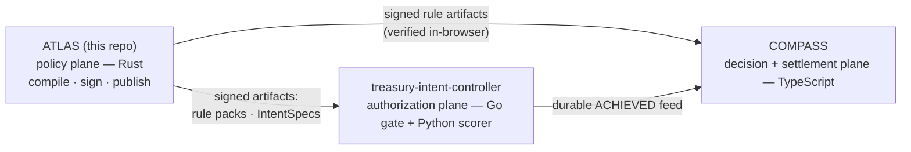
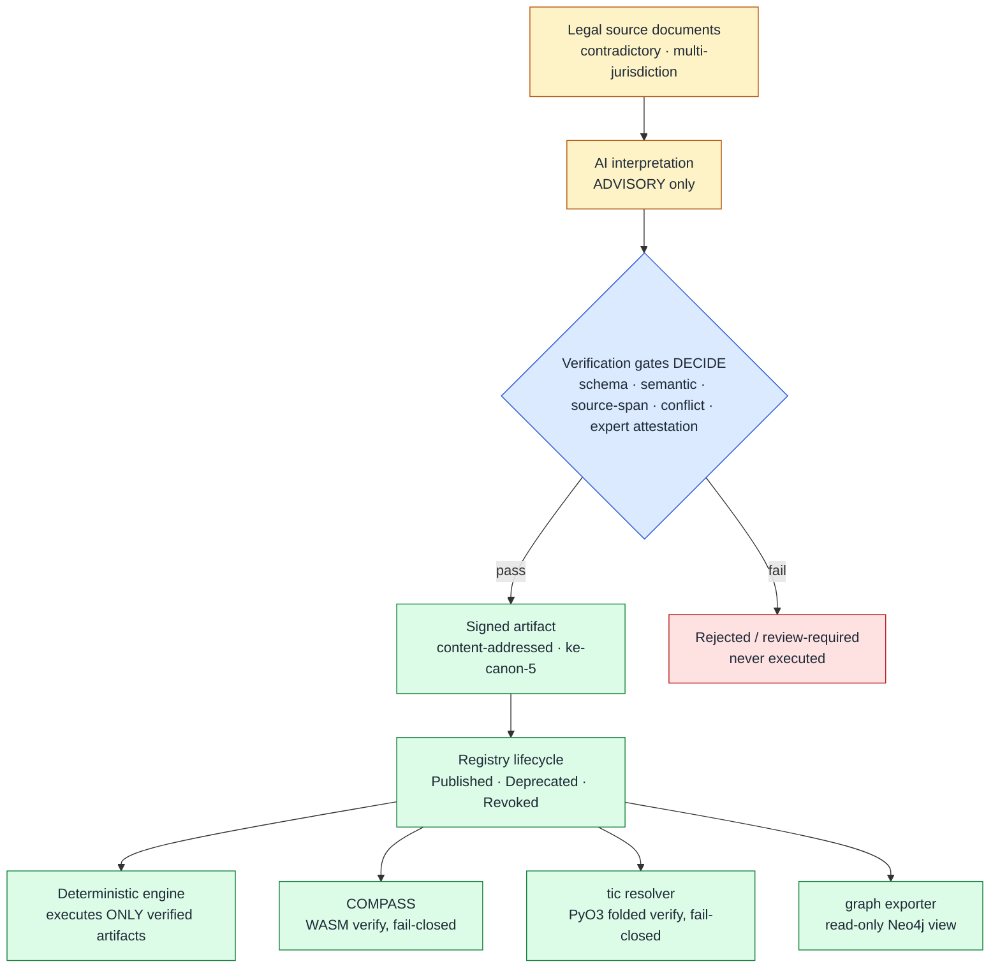

# ATLAS — Automated Transjurisdictional Legal Rule Assurance System

Compiles contradictory multi-jurisdiction regulation into machine-verified,
executable, auditable rule artifacts.

## 0. The system

ATLAS is the **policy plane** of a three-repo system: it compiles, signs, and
publishes the verified artifacts — rule packs and treasury IntentSpecs — that
the other planes consume. `treasury-intent-controller` authorizes payment
intents against ATLAS-signed IntentSpecs; COMPASS decides and settles from
the gate's durable feed.

Full story and live-loop evidence: [docs/SYSTEM.md](docs/SYSTEM.md).

## What it is

Not a retrieval application — retrieval finds relevant passages; ATLAS turns
legal text into verified, executable rule artifacts. AI may **interpret**
source documents (advisory only); verification gates and typed expert
attestations **decide** what becomes trusted; a deterministic engine
**executes** only verified, signed, content-addressed artifacts.

## The trust pipeline

**ATLAS never executes an unverified candidate rule.**

## What makes it different

- **Byte-deterministic canon.** Every artifact is a pure function of its
  input (`ke-canon-5`); a 3-language contract test proves Rust ≡ Python ≡
  WASM byte-identically in CI ([encoding profile](docs/canonical-encoding.md)).
- **Cryptography is not legal truth.** Only typed, kind-aware expert
  attestations bound to an artifact hash carry legal authority
  ([attestation schema](docs/attestation-schema.md)).
- **Proof by differential, with negative controls.** Rust↔Python equivalence
  over 1,326 generated scenarios; Cypher↔Rust graph oracles where a mutated
  edge must break the harness ([STATUS](docs/STATUS.md)).
- **Consumers re-derive trust and fail closed.** Three of them — COMPASS
  (WASM), the treasury resolver (PyO3), the graph exporter — all reject
  non-`Published` artifacts even with valid crypto
  ([consumer contract](docs/consumer-serve-contract.md)).
- **One signed envelope, polymorphic payloads.** Rules and treasury
  IntentSpecs ship through the same content-addressed artifact
  ([ADR-0021](docs/adr/0021-intentspec-artifact-kind-polymorphic-payload.md)/[0022](docs/adr/0022-intentspec-r7-coattestation.md)).

## Verification tiers

| Tier | Check | Authority |
|------|-------|-----------|
| **T0** | Schema and structural validity | Compiler (Rust, deterministic) |
| **T1** | Semantic well-formedness (type, domain, span integrity) | Compiler |
| **T2** | Scenario coverage / property tests | Compiler + curated suites |
| **T3** | Rust↔Python equivalence on fixtures | Differential harness |
| **T4** | Cross-jurisdictional conflict taxonomy | Compiler (structural) + AI rationale (advisory only) |
| **Expert** | Typed attestation bound to artifact hash | Domain expert (signed) |
| **Registry** | Lifecycle transition: candidate → published → revoked | Registry (verifies all of the above) |

Compiler tiers are structural — they never assert legal truth. Spec § 5, § 10, § 13.

## Where things live

- [docs/SYSTEM.md](docs/SYSTEM.md) — the three-repo system and the live payment loop
- [docs/STATUS.md](docs/STATUS.md) — gates, workstreams, deployment, CI
- [docs/DEVELOPMENT.md](docs/DEVELOPMENT.md) — build, test, harnesses, repo layout
- [docs/adr/](docs/adr/README.md) — 23 decision records + the tie-together map
- [Migration spec v3.1](docs/spec/ke-workbench-rust-migration-spec-v3.1.md) — plan of record (amendment banners mark superseded sections)
- [Canonical encoding](docs/canonical-encoding.md) · [Attestation schema](docs/attestation-schema.md) · [Consumer contract](docs/consumer-serve-contract.md)
- [CLAUDE.md](CLAUDE.md) — session discipline and hard invariants

Research project — not legal advice; encoded rules are interpretive models.
License: proprietary.
