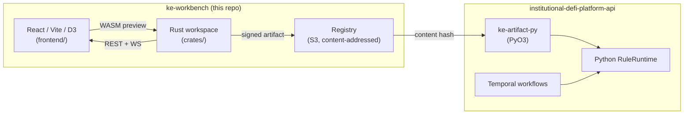

# ATLAS Technical Specification

## Automated Transjurisdictional Legal Rule Assurance System

ATLAS is a knowledge-engineering workbench for compiling contradictory
multi-jurisdiction regulation into machine-verified, executable, and auditable
rule artifacts. It is not a retrieval application. Retrieval finds relevant
passages; ATLAS turns legal text into verified rule packs, detects conflicts
across jurisdictions, and emits deterministic decision traces that can be
audited, replayed, and governed.

The system is implemented as the unified `ke-workbench` product shell with a
Rust-based knowledge-engineering core, a React frontend, and platform
integration paths for existing Python/FastAPI regulatory workflows.

## Product Thesis

ATLAS separates legal interpretation from legal execution.

- **AI may interpret source documents** by extracting candidate rules,
  provisions, obligations, and citations.
- **Humans and verification tiers decide what becomes trusted** through
  schema, semantic, source-span, conflict, and expert-review gates.
- **The deterministic engine executes only verified artifacts** using stable
  IR, signed content-addressed rule artifacts, and replayable audit traces.

The core invariant is:

> ATLAS must never execute an unverified candidate rule.

This invariant is enforced through artifact status, registry state, signature
validation, attestation checks, runtime policy, and platform-side fail-closed
behavior.

---

## Status

| Gate | State | Notes |
|------|-------|-------|
| **Gate 0 — Repo synthesis** | Complete locally, on `migration/gate-0-repo-synthesis` | Rename to `ke-workbench`, Rust workspace scaffold, frontend relocated to `frontend/`, CI/CD wired, fixtures snapshotted from platform repo. Awaiting review/merge to `main`. |
| **Gate 1 — Canonical IR** | Brief authored — see [`docs/gate-1-canonical-ir.md`](docs/gate-1-canonical-ir.md) | Begins after Gate 0 merge. Defines IR types, canonical encoding profile, JSON Schema emission, and golden fixtures. Authoritative plan: [spec v3.1](docs/spec/ke-workbench-rust-migration-spec-v3.1.md). |

Rust crates under `crates/` are scaffolded but not yet functional. The
frontend continues to consume an external backend via `VITE_API_URL` and is
preserved through Gate 4 (see [CLAUDE.md](CLAUDE.md)).

---

## Architecture



`ke-workbench` is one product — Rust compiler + React/D3 authoring UI + WASM
preview + axum REST + signed, content-addressed artifacts — in one repo. The
institutional DeFi platform (`institutional-defi-platform-api`) is the
**consumer** that executes signed artifacts in production via Python
`RuleRuntime`. There is no third repo and no shared library; **the artifact
is the contract**.

The system separates **structural correctness** (Rust-enforced, deterministic,
continuous) from **semantic correctness** (domain-expert attested, typed,
cryptographically bound). Cryptographic signatures are not legal truth — only
typed expert attestations bound to a specific artifact hash carry that
authority. See spec § 5, § 10.

---

## Verification tiers

ATLAS gates a candidate rule through a layered verification stack before it
becomes executable:

| Tier | Check | Authority |
|------|-------|-----------|
| **T0** | Schema and structural validity | Compiler (Rust, deterministic) |
| **T1** | Semantic well-formedness (type, domain, span integrity) | Compiler |
| **T2** | Scenario coverage / property tests | Compiler + curated suites |
| **T3** | Rust↔Python equivalence on fixtures | Differential harness |
| **T4** | Cross-jurisdictional conflict taxonomy | Compiler (structural) + AI rationale (advisory only) |
| **Expert** | Typed attestation bound to artifact hash | Domain expert (signed) |
| **Registry** | Lifecycle transition: candidate → published → revoked | Registry (verifies all of the above) |

Compiler tiers (T0–T4) are structural. They never assert legal truth. Legal
authority comes only from typed expert attestations, and only the registry
can transition lifecycle state. Spec § 5, § 10, § 13.

---

## Repo layout

```text
ke-workbench/
├── Cargo.toml                   # Rust workspace root
├── rust-toolchain.toml          # pinned stable toolchain
├── Dockerfile                   # frontend image (build context = repo root)
├── nginx.conf                   # frontend reverse proxy
├── CLAUDE.md                    # session discipline + hard invariants
├── crates/
│   ├── ke-core/                 # IR, AST, canonicalization        (Gate 1)
│   ├── ke-compiler/             # YAML → IR + T0/T1/T4              (Gate 2)
│   ├── ke-runtime/              # preview executor (NOT prod)        (Gate 3)
│   ├── ke-artifact/             # canonical encoding + signatures   (Gate 4)
│   ├── ke-cli/                  # ke compile/verify/attest/serve    (Gate 4)
│   └── ke-wasm/                 # browser preview bindings           (Gate 5)
├── crates-deferred/             # ke-search, ke-registry, ke-lint, ke-artifact-py
├── frontend/                    # React 18 + TypeScript + Vite + D3.js
├── fixtures/
│   ├── rules/                   # YAML corpus snapshot + SOURCE.md
│   ├── traces/                  # Python runtime traces (Gate 3+)
│   └── artifacts/               # golden artifact bytes (Gate 1+)
├── docs/
│   ├── spec/                    # ke-workbench-rust-migration-spec-v3.1.md
│   ├── gate-1-canonical-ir.md   # Gate 1 implementation brief
│   ├── canonical-encoding.md    # filled in during Gate 1
│   ├── attestation-schema.md    # filled in pre-Gate 4
│   └── adr/                     # architecture decision records
├── scripts/
│   ├── bootstrap.sh             # snapshot platform rules → fixtures/rules/
│   ├── differential-test.sh     # (Gate 2)
│   └── equivalence-harness.sh   # (Gate 3)
├── kube/                        # Kubernetes manifests (frontend)
└── .github/workflows/           # rust-ci, frontend-ci, wasm-build, contract-tests, cd-*
```

`fixtures/` is read-only inside ordinary sessions. Updates flow only through
documented sync/generation scripts. See [CLAUDE.md](CLAUDE.md).

---

## Quick start

### Frontend (Gate 0 path)

```bash
cd frontend
npm ci
npm run dev          # http://localhost:5173
```

Set `VITE_API_URL` to point at a running backend instance, or use the default
`/api` proxy. Gate 0 preserves existing frontend behavior — it continues to
consume the external backend API until Gate 5 rewires it to local Rust
surfaces (REST + WASM) behind feature flags.

### Rust workspace (scaffolds only)

```bash
cargo check --workspace        # currently passes against empty crates
cargo fmt --all -- --check
cargo clippy --workspace --all-targets -- -D warnings
```

Gate 1 onwards fills in real implementations. See the [Gate 1 brief](docs/gate-1-canonical-ir.md)
and the [migration roadmap](#migration-roadmap) below.

### Platform fixtures

Rules consumed by Gate 1+ live in `fixtures/rules/`, snapshotted from
`institutional-defi-platform-api/src/rules/data/` via:

```bash
./scripts/bootstrap.sh
```

The script expects `institutional-defi-platform-api` as a sibling of
`ke-workbench`, or `PLATFORM_REPO` set explicitly. Provenance is recorded in
[`fixtures/rules/SOURCE.md`](fixtures/rules/SOURCE.md). See spec § 4.5.

---

## Migration roadmap

| Gate | Scope | Status |
|------|-------|--------|
| **0** | Repo synthesis: rename, restructure, Rust scaffold, CLAUDE.md, CI | **complete (awaiting merge)** |
| **1** | Canonical IR, artifact bytes, golden fixtures, JSON Schema | brief authored |
| **2** | YAML parser, compiler, T0/T1/T4 verification + conflict taxonomy | pending |
| **3** | Rust preview runtime + fuzzed equivalence vs Python `RuleRuntime` | pending |
| **4** | `ke-artifact` canonical encoding + signing + `ke-artifact-py` PyO3 wheel + registry; platform unblock | pending |
| **5** | `ke-cli serve` (REST + WS), WASM bindings, page-by-page frontend rewire | pending |
| **6** | Platform cutover: Temporal artifact pinning, removal of Python KE module | pending |

Each gate produces a commit boundary on a `migration/gate-N-*` branch.
Acceptance criteria are in spec § 19. **No gate may begin until the prior
gate's acceptance criteria are green.**

---

## Regulatory frameworks

| Framework | Jurisdiction | Status |
|-----------|--------------|--------|
| **MiCA** | EU | Enacted (2023/1114) |
| **FCA Crypto** | UK | Enacted (COBS 4.12A) |
| **GENIUS Act** | US | Enacted (July 2025) |
| **FINMA DLT** | Switzerland | Enacted (DLT Act 2021) |
| **MAS PSA** | Singapore | Enacted (PSA 2019) |
| **RWA Authorization** | Multi-jurisdictional | Demo regime |

Source YAML lives in `fixtures/rules/`; the authoritative copy is in
`institutional-defi-platform-api/src/rules/data/`.

---

## Deployment

| Component | Platform |
|-----------|----------|
| **Frontend** | AWS EKS (Kustomize overlays under `kube/`) |
| **Backend API** | `institutional-defi-platform-api` (separate repo) |
| **Registry (Gate 4+)** | S3-backed, content-addressed; PEP 503 simple index for `ke-artifact-py` |

The frontend image is built from the repo-root `Dockerfile` with the
`frontend/` subdirectory as input. EKS subpath support is controlled by the
`VITE_BASE_PATH` build arg.

CI/CD:

| Workflow | Trigger | Purpose |
|----------|---------|---------|
| `rust-ci.yml` | Push, PR | `cargo fmt` / `clippy` / `check` / `test` on the workspace |
| `frontend-ci.yml` | Push, PR | npm lint, typecheck, test, build, docker build |
| `wasm-build.yml` | Push, PR | stub (Gate 5 wires the real `wasm-bindgen` build) |
| `contract-tests.yml` | Push, PR | stub (Gate 4 wires Rust ↔ Python contract tests) |
| `cd-staging.yml` | Push to `main` | Build + push image, deploy to EKS staging |
| `cd-production.yml` | Manual | Approval-gated production deploy with rollback |

---

## Authority boundaries (hard rules)

- **Compiler authority** — structural validity only. Never legal truth.
- **AI authority** — may propose edits, rationales, source-span mappings,
  scenario candidates, conflict explanations. **May not attest, publish,
  revoke, or silently modify committed rules.**
- **Domain expert authority** — the only authority that can sign typed
  attestations bound to a specific artifact hash.
- **Registry authority** — the only authority that can transition artifact
  lifecycle state after verifying signatures, keys, revocation, and required
  checks.
- **WASM is preview-only** — browser code may not sign, attest, publish, or
  otherwise produce authoritative artifacts. The canonical compile path is
  `ke-cli compile` against an authoritative registry. Spec § 6, § 16.

See spec § 5, § 10, § 13.

---

## Further reading

- [Migration spec v3.1](docs/spec/ke-workbench-rust-migration-spec-v3.1.md) — authoritative plan, acceptance criteria, open decisions
- [Gate 1 brief](docs/gate-1-canonical-ir.md) — canonical IR design and exit checks
- [Canonical encoding profile](docs/canonical-encoding.md) — filled in during Gate 1
- [Attestation schema](docs/attestation-schema.md) — filled in pre-Gate 4
- [ADRs](docs/adr/) — architecture decision records
- [CLAUDE.md](CLAUDE.md) — session discipline and hard invariants

---

## Disclaimer

Research project. Not legal advice. Encoded rules are interpretive models —
consult qualified legal counsel for compliance decisions.

## License

Proprietary. See [LICENSE](LICENSE) if present.
