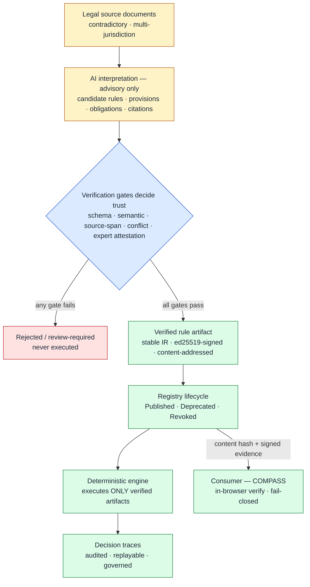
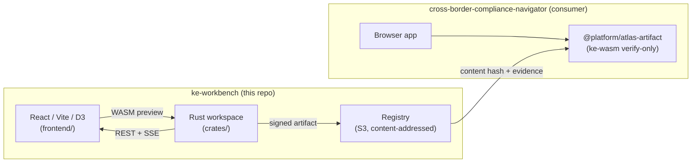

# ATLAS Technical Specification

## Automated Transjurisdictional Legal Rule Assurance System

ATLAS is a knowledge-engineering workbench for compiling contradictory
multi-jurisdiction regulation into machine-verified, executable, and auditable
rule artifacts. It is not a retrieval application. Retrieval finds relevant
passages; ATLAS turns legal text into verified rule packs, detects conflicts
across jurisdictions, and emits deterministic decision traces that can be
audited, replayed, and governed.

The system is implemented as the unified `ke-workbench` product shell with a
Rust-based knowledge-engineering core, a React frontend, and platform
integration paths for existing Python/FastAPI regulatory workflows.

## Product Thesis

ATLAS separates legal interpretation from legal execution.

- **AI may interpret source documents** by extracting candidate rules,
  provisions, obligations, and citations.
- **Humans and verification tiers decide what becomes trusted** through
  schema, semantic, source-span, conflict, and expert-review gates.
- **The deterministic engine executes only verified artifacts** using stable
  IR, signed content-addressed rule artifacts, and replayable audit traces.

The core invariant is:

> ATLAS must never execute an unverified candidate rule.

This invariant is enforced through artifact status, registry state, signature
validation, attestation checks, runtime policy, and consumer-side fail-closed
behavior (the consumer rejects any non-verified / non-`Published` artifact).

---

## How ATLAS works

Interpretation is **advisory** (AI proposes candidates); the **verification gates
decide** what becomes trusted; the **deterministic engine executes only** verified,
signed, content-addressed artifacts — the core invariant. The consumer (COMPASS)
re-verifies in-browser and fails closed.



---

## Status

| Gate | State | Notes |
|------|-------|-------|
| **Gate 0 — Repo synthesis** | **Merged (PR #3)** | Rename to `ke-workbench`, Rust workspace scaffold, frontend relocated to `frontend/`, CI/CD wired, fixtures snapshotted from platform repo. |
| **Gate 1 — Canonical IR** | Complete — log: [`docs/gate-1-implementation-log.md`](docs/gate-1-implementation-log.md) | `ke-core` IR types, canonical (postcard) encoding + strict decoder, deterministic JSON Schema, golden fixtures. 19 tests green. ADRs 0001–0003. |
| **Gate 2 — Parser, compiler, T0/T1/T4** | **Accepted (2026-05-30)** — log: [`docs/gate-2-implementation-log.md`](docs/gate-2-implementation-log.md) | `ke-compiler` `marked-yaml` parser → AST → `RuleIR` lowering, semantic normal form + differential harness, T0/T1/T4. 23 test suites green; **live Rust↔Python differential PASS over all 7 corpus files** (platform @ recorded SOURCE.md SHA); ADR 0005 (T4 severities) signed off. ADRs 0004–0006. **Merged (PR #5)**. |
| **Gate 3 — Preview runtime + equivalence harness** | **Merged 2026-05-31 (PR #6)** — log: [`docs/gate-3-implementation-log.md`](docs/gate-3-implementation-log.md) | `ke-runtime` tree-walk preview executor mirroring the Python `RuleRuntime` (CPython-faithful operators, normalized trace), deterministic scenario generator, property/metamorphic tests. **Live Rust↔Python equivalence PASS over 1326 generated scenarios** (platform @ recorded SOURCE.md SHA); 35 golden trace fixtures. tz-optional IR amendment (ADR 0007) — Gate 2 differential still 7/7. ADRs 0007–0008. 71 tests across 28 suites. |
| **Gate 4 — Artifact, registry, attestation, consumer-agnostic verification** | **Complete (in-repo) — acceptance: [`docs/gate-4-acceptance.md`](docs/gate-4-acceptance.md); log: [`docs/gate-4-implementation-log.md`](docs/gate-4-implementation-log.md)** | ADRs 0009–0016 accepted. `ke-artifact`: BLAKE3 zero-then-patch content addressing + ed25519 compiler signature, typed expert attestations + R1–R8 rejection rules, a pure RNG-free `verify_artifact` surface + `ArtifactProvenance` export. `ke-cli`: the §9 registry lifecycle (`compile`→`revoke`+`rollback`) on a local-FS backend (S3 behind a trait seam). PyO3 wheel + WASM verifier (`@platform/atlas-artifact`) + a **3-language contract test** (Rust ≡ Python ≡ WASM). **§19 verdict:** C3 (specific-policy rejection) **met**; C4 (rollback → prior *distinct* hash) **met**; **C1 verifier + C2 equivalence foundation met in-repo** — per **ADR-0017** `institutional-defi-platform-api` is decoupled (not the consumer), so the consumer integration is COMPASS's (post-Gate-5) and the platform execute-parity is obsolete. |
| **Gate 5 — Surface rollout + frontend rewire** | **ATLAS surfaces complete (in-repo)** — log: [`docs/gate-5-implementation-log.md`](docs/gate-5-implementation-log.md) | **5a ✅** `ke-cli serve` (tiny_http REST + SSE, non-authoritative; ADR-0018 — SSE not WebSocket because tokio/tungstenite don't build on windows-gnu). **5b-preview ✅** `ke-wasm` `compile_preview`/`dry_run` bindings + `frontend/src/wasm/` (G5-2 parity-proven; verifier untouched). **5b-data** `.kew` export/import **✅** (G5-4, skeptic-proven over a 14.7k-tamper sweep); DuckDB SQL views **✅ G5-3 green on CI** (column-names read before query execution → schema panic; fixed by reordering; now green on the Linux `ke sql` DuckDB leg). **5c ✅** lint (compiler advisory `T5` + `ke lint`). **5d/5e 🟡 DEFERRED** — the ATLAS frontend rewire (5d) + the §13 AI-provenance review UI (5e) are **deferred, not delivered**. They are low-value post-ADR-0017: **COMPASS** (`cross-border-compliance-navigator`) is the **MAIN / real CONSUMER** of the ATLAS artifact path — it verifies hash, signatures, registry state, and typed expert attestations **in-browser** via the `@platform/atlas-artifact` WASM verifier; **consumer-only** (it does not sign, publish, or execute the rule engine), gated post-Gate-5 (**ADR-0017/0019**). ATLAS's own React frontend is **producer-side authoring/review tooling, not the consumer**, and most of its pages (ML/analytics/jurisdiction/credit) are off the artifact path and cannot be rewired at all. What **landed** are the **engine surfaces** (5a serve, 5b-preview WASM, 5b-data export/import, 5c lint, above); the KEWorkbench in-browser WASM compile/dry-run **preview pane** + the 5e review components remain in the tree behind **default-off** flags (`VITE_USE_LOCAL_KE_API` / `VITE_USE_WASM_PREVIEW` / `VITE_USE_REVIEW_UI`) as **inert** optional affordances — kept, but **not** claimed as a delivered rewire. **G5-5 🟡 DEFERRED** (was "met, redefined"): the ATLAS frontend rewire is deferred; COMPASS is the consumer; revisit only if/when the ATLAS frontend genuinely needs the local surfaces. See **ADR-0020** (Accepted). **Live verifier loop proven end-to-end** — browser `@platform/atlas-artifact` build + seeded Published `ke serve` registry (merged PR #10); the COMPASS in-browser consumer was then verified live against it (consumer lives in its own repo, not merged here). Playwright visual harness is experimental/non-gating. |
| **Gate 6 — Revocation runtime-decision + registry surface (reconciled)** | **Planned — not started** — brief: [`dev/briefs/gate-6-plan-and-next-session-seed.md`](dev/briefs/gate-6-plan-and-next-session-seed.md) | Spec Gate 6 (platform Temporal cutover + Python KE module removal) is **out of scope post-ADR-0017** (platform decoupled; no orchestrator consumer). Pinning/rollback + verify-layer `Revoked` rejection already shipped (Gate 4). **Reconciled ATLAS scope:** a pure `revocation_decision` fn (reason-class → `HardStop`/`FinishPinned`/`AuditOnly`, ADR-0009 §4 / ADR-0013) surfaced at `/resolve`+`/verify`, plus serve `/resolve` ByRegime+effective. Decisions locked: **substantive build**; **accept ADR-0015 + add ADR-0021**. `verify` stays fail-closed. |

Gates 1–3 are **merged to `main`**; Gate 4 is **complete on the ATLAS side** on
`migration/gate-4-artifact` (`ke-core`, `ke-compiler`, `ke-runtime`, `ke-artifact`,
and the `ke-cli` registry are functional; the PyO3 + WASM verify bindings build).
The `ke-wasm` **verifier** was pulled into Gate 4 (ADR 0016) for the COMPASS
consumer; `ke-cli serve` (Gate 5a ✅) and the browser **preview**/dry-run bindings
(Gate 5b-preview ✅) have now landed. Per **ADR-0017** `institutional-defi-platform-api`
is decoupled (not the consumer) — Gate 4 closes on ATLAS evidence (C1 verifier + C2
equivalence foundation), and the live producer→consumer loop is demonstrated when
COMPASS rewires onto the published WASM verifier (post-Gate-5).
The frontend still consumes an external backend via `VITE_API_URL` and is
preserved through Gate 4; Gate 5 rewires it behind feature flags (see
[CLAUDE.md](CLAUDE.md)).

---

## Architecture



`ke-workbench` is one product — Rust compiler + React/D3 authoring UI + WASM
preview + `ke-cli serve` (tiny_http REST + SSE) + signed, content-addressed
artifacts — in one repo. The **consumer** is **COMPASS**
(`cross-border-compliance-navigator`), which verifies provenance + registry state
in-browser via the `@platform/atlas-artifact` WASM verifier (consumer-only — it
does not execute the rule engine). `institutional-defi-platform-api` is **decoupled**
(ADR-0017) and is not in the artifact path. There is no shared library; **the
artifact is the contract**.

The system separates **structural correctness** (Rust-enforced, deterministic,
continuous) from **semantic correctness** (domain-expert attested, typed,
cryptographically bound). Cryptographic signatures are not legal truth — only
typed expert attestations bound to a specific artifact hash carry that
authority. See spec § 5, § 10.

---

## Verification tiers

ATLAS gates a candidate rule through a layered verification stack before it
becomes executable:

| Tier | Check | Authority |
|------|-------|-----------|
| **T0** | Schema and structural validity | Compiler (Rust, deterministic) |
| **T1** | Semantic well-formedness (type, domain, span integrity) | Compiler |
| **T2** | Scenario coverage / property tests | Compiler + curated suites |
| **T3** | Rust↔Python equivalence on fixtures | Differential harness |
| **T4** | Cross-jurisdictional conflict taxonomy | Compiler (structural) + AI rationale (advisory only) |
| **Expert** | Typed attestation bound to artifact hash | Domain expert (signed) |
| **Registry** | Lifecycle transition: candidate → published → revoked | Registry (verifies all of the above) |

Compiler tiers (T0–T4) are structural. They never assert legal truth. Legal
authority comes only from typed expert attestations, and only the registry
can transition lifecycle state. Spec § 5, § 10, § 13.

---

## Repo layout

```text
ke-workbench/
├── Cargo.toml                   # Rust workspace root
├── rust-toolchain.toml          # pinned stable toolchain
├── Dockerfile                   # frontend image (build context = repo root)
├── nginx.conf                   # frontend reverse proxy
├── CLAUDE.md                    # session discipline + hard invariants
├── crates/
│   ├── ke-core/                 # IR, AST, canonicalization        (Gate 1)
│   ├── ke-compiler/             # YAML → IR + T0/T1/T4              (Gate 2)
│   ├── ke-runtime/              # preview executor (NOT prod)        (Gate 3)
│   ├── ke-artifact/             # canonical encoding + signatures   (Gate 4)
│   ├── ke-cli/                  # ke compile/verify/attest/lint/export/import/sql; serve   (Gate 4; serve 5a, 5b-data, 5c)
│   └── ke-wasm/                 # browser verify (G4) + preview (G5b) (Gate 4/5)
├── crates-deferred/             # ke-search, ke-registry, ke-lint, ke-artifact-py
├── frontend/                    # React 18 + TypeScript + Vite + D3.js
├── fixtures/
│   ├── rules/                   # YAML corpus snapshot + SOURCE.md
│   ├── traces/                  # Python runtime traces (Gate 3+)
│   └── artifacts/               # golden artifact bytes (Gate 1+)
├── dev/briefs/                  # per-gate Claude Code session briefs (Gate 2+)
├── docs/
│   ├── spec/                    # ke-workbench-rust-migration-spec-v3.1.md
│   ├── gate-1-*.md, gate-2-*.md # gate briefs + implementation logs
│   ├── canonical-encoding.md    # authoritative encoding profile (Gate 1)
│   ├── dsl-gap-review-gate-2.md # regime coverage walk (Gate 2)
│   ├── attestation-schema.md    # filled in pre-Gate 4
│   └── adr/                     # architecture decision records (0001–0019)
├── scripts/
│   ├── bootstrap.sh             # snapshot platform rules → fixtures/rules/
│   ├── generate-golden-fixtures.sh # Gate 1 golden fixtures (synthetic mode)
│   ├── differential-test.sh     # Gate 2: Rust↔Python parity (SHA-gated)
│   └── equivalence-harness.sh   # (Gate 3)
├── kube/                        # Kubernetes manifests (frontend)
└── .github/workflows/           # rust-ci, frontend-ci, wasm-build, contract-tests, cd-*
```

`fixtures/` is read-only inside ordinary sessions. Updates flow only through
documented sync/generation scripts. See [CLAUDE.md](CLAUDE.md).

---

## Quick start

### Frontend (Gate 0 path)

```bash
cd frontend
npm ci
npm run dev          # http://localhost:5173
```

Set `VITE_API_URL` to point at a running backend instance, or use the default
`/api` proxy. Gate 0 preserves existing frontend behavior — it continues to
consume the external backend API until Gate 5 rewires it to local Rust
surfaces (REST + WASM) behind feature flags.

### Rust workspace

Toolchain is pinned to Rust 1.85.0 (`rust-toolchain.toml`). Install via
[rustup](https://rustup.rs/); `rustup` puts `cargo` under `~/.cargo/bin`, which
a fresh shell (e.g. MINGW64 / Git Bash) may not have on `PATH`:

```bash
source "$HOME/.cargo/env"        # or: export PATH="$HOME/.cargo/bin:$PATH"
```

```bash
cargo test --workspace                                  # Gates 1–2 are implemented + tested
cargo fmt --all -- --check
cargo clippy --workspace --all-targets -- -D warnings

# regenerate the committed JSON Schema / golden fixtures (must be byte-stable)
cargo run -p ke-core --bin emit-schema
cargo run -p ke-core --bin gen-fixtures

# compile a rule file and emit its semantic normal form
cargo run -p ke-compiler --bin ke-compile -- compile fixtures/rules/mica_stablecoin.yaml
```

The **Rust↔Python differential** (Gate 2 acceptance) requires the platform repo
checked out at the SHA recorded in [`fixtures/rules/SOURCE.md`](fixtures/rules/SOURCE.md):

```bash
git -C ../institutional-defi-platform-api checkout <recorded-SOURCE.md-SHA>
./scripts/differential-test.sh        # fails fast unless the SHA matches
```

See the [Gate 2 brief](dev/briefs/gate-2-parser-compiler-verification.md) and the
[migration roadmap](#migration-roadmap) below.

### Platform fixtures

Rules consumed by Gate 1+ live in `fixtures/rules/`, snapshotted from
`institutional-defi-platform-api/src/rules/data/` via:

```bash
./scripts/bootstrap.sh
```

The script expects `institutional-defi-platform-api` as a sibling of
`ke-workbench`, or `PLATFORM_REPO` set explicitly. Provenance is recorded in
[`fixtures/rules/SOURCE.md`](fixtures/rules/SOURCE.md). See spec § 4.5.

---

## Migration roadmap

| Gate | Scope | Status |
|------|-------|--------|
| **0** | Repo synthesis: rename, restructure, Rust scaffold, CLAUDE.md, CI | **merged (PR #3)** |
| **1** | Canonical IR, artifact bytes, golden fixtures, JSON Schema | **complete** |
| **2** | YAML parser, compiler, T0/T1/T4 verification + conflict taxonomy | **accepted** (live differential PASS + ADR 0005 signed) |
| **3** | Rust preview runtime + fuzzed equivalence vs Python `RuleRuntime` | **merged (PR #6)** — live equivalence PASS over 1326 scenarios; ADRs 0007–0008 (incl. Gate-4 readiness decisions) |
| **4** | `ke-artifact` signing + attestations + registry lifecycle + consumer-agnostic verify surface + PyO3/WASM verify bindings + 3-language contract test | **Complete (in-repo)** — ADRs 0009–0016; [acceptance](docs/gate-4-acceptance.md): C3 met, C4 met, **C1 verifier + C2 equivalence foundation met in-repo**. Per [ADR-0017](docs/adr/0017-gate5-sequencing-atlas-surfaces-independent.md), platform-api is decoupled (not the consumer); consumer integration is COMPASS's (post-Gate-5), platform execute-parity obsolete. |
| **5** | `ke-cli serve` (REST + SSE), `ke-wasm` browser **preview** bindings + `frontend/src/wasm/`, DuckDB SQL views, flat-file export, lint integration, page-by-page frontend rewire behind `VITE_USE_*` flags, minimum AI-provenance review UI (§13) | **in progress** — [log](docs/gate-5-implementation-log.md): 5a `ke-cli serve` ✅ (tiny_http+SSE, [ADR-0018](docs/adr/0018-serve-transport-sse-and-non-authoritative-scope.md)); 5b-preview `ke-wasm` compile/dry-run ✅ (G5-2 parity); 5b-data `.kew` export/import ✅ (G5-4); DuckDB SQL views ✅ (G5-3 green on the Linux `ke sql` CI leg). The WASM *verifier* already shipped in Gate 4 (ADR 0016); Gate 5 adds the *preview/dry-run* bindings + the surface rollout. |
| **6** | **Reconciled (ADR-0021):** spec's platform Temporal cutover + Python KE module removal is **out of scope** post-ADR-0017 (platform decoupled; no orchestrator consumer). ATLAS delivers revocation runtime-**decision** (reason-class → `HardStop`/`FinishPinned`/`AuditOnly`) surfaced at `/resolve`+`/verify`, plus serve `/resolve` ByRegime+effective | **planned — not started**; brief: [`dev/briefs/gate-6-plan-and-next-session-seed.md`](dev/briefs/gate-6-plan-and-next-session-seed.md) |

Each gate produces a commit boundary on a `migration/gate-N-*` branch.
Acceptance criteria are in spec § 19. **No gate may begin until the prior
gate's acceptance criteria are green.**

---

## Regulatory frameworks

| Framework | Jurisdiction | Status |
|-----------|--------------|--------|
| **MiCA** | EU | Enacted (2023/1114) |
| **FCA Crypto** | UK | Enacted (COBS 4.12A) |
| **GENIUS Act** | US | Enacted (July 2025) |
| **FINMA DLT** | Switzerland | Enacted (DLT Act 2021) |
| **MAS PSA** | Singapore | Enacted (PSA 2019) |
| **RWA Authorization** | Multi-jurisdictional | Demo regime |

Source YAML lives in `fixtures/rules/`; the authoritative copy is in
`institutional-defi-platform-api/src/rules/data/`.

---

## Deployment

| Component | Platform |
|-----------|----------|
| **Frontend** | AWS EKS (Kustomize overlays under `kube/`) |
| **Backend API** | `institutional-defi-platform-api` — **decoupled** (ADR-0017); not in the artifact path |
| **Registry (Gate 4+)** | S3-backed, content-addressed; PEP 503 simple index for `ke-artifact-py` |

The frontend image is built from the repo-root `Dockerfile` with the
`frontend/` subdirectory as input. EKS subpath support is controlled by the
`VITE_BASE_PATH` build arg.

CI/CD:

| Workflow | Trigger | Purpose |
|----------|---------|---------|
| `rust-ci.yml` | Push, PR | `cargo fmt` / `clippy` / `check` / `test` on the workspace |
| `frontend-ci.yml` | Push, PR | npm lint, typecheck, test, build, docker build |
| `wasm-build.yml` | Push, PR | real `wasm-bindgen` preview build (Gate 5b); cli↔crate wasm-bindgen pin asserted |
| `contract-tests.yml` | Push, PR | **3-language contract test** (Gate 4): builds the `ke-artifact-py` wheel + the WASM package, runs `scripts/contract-test.sh` (Rust ≡ Python ≡ WASM over golden `.kew`), SHA-gated to `SOURCE.md` |
| `cd-staging.yml` | Push to `main` | Build + push image, deploy to EKS staging |
| `cd-production.yml` | Manual | Approval-gated production deploy with rollback |

---

## Authority boundaries (hard rules)

- **Compiler authority** — structural validity only. Never legal truth.
- **AI authority** — may propose edits, rationales, source-span mappings,
  scenario candidates, conflict explanations. **May not attest, publish,
  revoke, or silently modify committed rules.**
- **Domain expert authority** — the only authority that can sign typed
  attestations bound to a specific artifact hash.
- **Registry authority** — the only authority that can transition artifact
  lifecycle state after verifying signatures, keys, revocation, and required
  checks.
- **WASM is preview-only** — browser code may not sign, attest, publish, or
  otherwise produce authoritative artifacts. The canonical compile path is
  `ke-cli compile` against an authoritative registry. Spec § 6, § 16.

See spec § 5, § 10, § 13.

---

## Further reading

- [Migration spec v3.1](docs/spec/ke-workbench-rust-migration-spec-v3.1.md) — authoritative plan, acceptance criteria, open decisions
- [Gate 1 brief](docs/gate-1-canonical-ir.md) · [Gate 1 log](docs/gate-1-implementation-log.md) — canonical IR design + what landed
- [Gate 2 brief](dev/briefs/gate-2-parser-compiler-verification.md) · [Gate 2 log](docs/gate-2-implementation-log.md) — parser/compiler/verification + what landed
- [Canonical encoding profile](docs/canonical-encoding.md) — authoritative encoding rules (version `0.4.0` / `postcard-1` / `ke-canon-4`)
- [DSL gap review](docs/dsl-gap-review-gate-2.md) — regime coverage walk (Gate 2)
- [Attestation schema](docs/attestation-schema.md) — filled in pre-Gate 4
- [ADRs](docs/adr/) — architecture decision records (0001–0019); recent: 0017 (platform decoupled / Gate-5 sequencing), 0018 (`ke serve` SSE + non-authoritative), 0019 (governance framing + COMPASS consumer trust boundary)
- [CLAUDE.md](CLAUDE.md) — session discipline and hard invariants

---

## Disclaimer

Research project. Not legal advice. Encoded rules are interpretive models —
consult qualified legal counsel for compliance decisions.

## License

Proprietary. See [LICENSE](LICENSE) if present.
