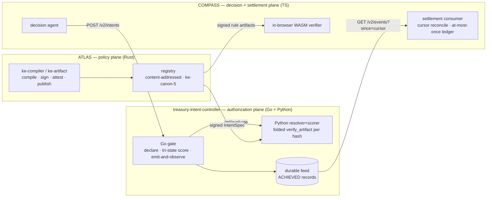
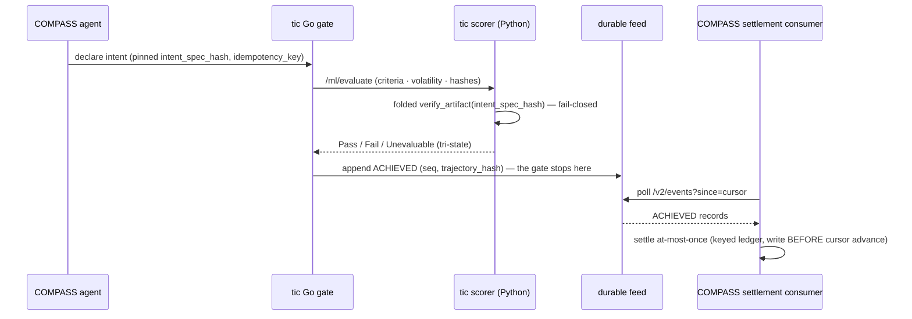

# The system: ATLAS · treasury-intent-controller · COMPASS

Three repos, three planes, one artifact contract. State as of 2026-07-15.

## Planes

**ATLAS** (this repo, Rust) is the **policy plane**: it compiles, signs, and
publishes verified rule packs *and* treasury IntentSpecs through one
content-addressed envelope (`ke-canon-5`; `ArtifactPayload = Rules |
IntentSpec`, ADR-0021). It is the sole authority for artifact lifecycle —
nothing downstream can sign, attest, publish, or revoke.

**treasury-intent-controller** (Go + Python) is the **authorization plane**:
its Go gate declares payment intents and scores them tri-state — Pass / Fail
/ Unevaluable, where `Unevaluable` never collapses into a pass — and its
Python resolver+scorer folds `ke_artifact_py.verify_artifact` over the pinned
`intent_spec_hash` before any criterion is scored (absent, rejected, or
re-address-mismatched artifacts fail closed). The gate is emit-and-observe:
it stops at appending the single `ACHIEVED` record to a durable feed and
never settles in-process.

**COMPASS** (`cross-border-compliance-navigator`, TypeScript) is the
**decision + settlement plane**: its decision agent declares intents against
the pinned signed IntentSpec (refusing unpinned specs, holding no dispatch
handle), and its settlement consumer pulls the gate's durable feed by cursor
and settles **at-most-once** into a keyed ledger — settlements written
*before* the cursor advances, same-key conflicts surfaced, never resolved
silently. COMPASS also verifies ATLAS rule artifacts in-browser via the
`@platform/atlas-artifact` WASM verifier.

## The two contracts that bind the system

1. **The signed artifact** — content-addressed canonical bytes
   (`0.5.0` / `postcard-1` / `ke-canon-5`), polymorphic payload, typed
   kind-aware expert attestations (ADR-0022). The artifact is the contract;
   there is no shared library.
2. **The `ACHIEVED` trace record** — `{intent_id, idempotency_key,
   rule_artifact_hash, intent_spec_hash, trajectory_hash, seq}` — the only
   thing a settlement may be computed from, joining the runtime trace back
   to the exact signed policy it was authorized under.

## Plane map

## One discipline, three consumers

Every consumer of the artifact plane operates under **ADR-0019**: it
re-derives trust itself, treats anything non-`Published` as blocked *even
with valid cryptography*, and fails closed on `unknown`. The three consumers:
COMPASS (in-browser WASM verify), the tic resolver (PyO3 folded verify per
hash), and the graph exporter (`ke graph export` — a read-only derived Neo4j
view, ADR-0023). None holds any authority.

## The payment loop, live-verified

The full loop ran **green live on 2026-07-12**: COMPASS declare → Go gate →
wheel-verified scorer (real `verify_artifact` of the golden IntentSpec) →
`ACHIEVED` in the durable feed → cursor reconcile → settlements carrying the
full trace record. The negatives were probed live, not assumed: a
cursor-rewind restatement re-observed the feed and left the ledger
**byte-identical** (duplicates counted, zero applied), and a real scorer
kill made the next declaration `FAILED unevaluable:` with **zero** new
settlements — outage means delay, never loss or invention. Sources: tic
`docs/handoff/2026-07-13-atlas-treasury-payment-loop.md` and
`docs/learnings/`; COMPASS PR #7; ATLAS PRs #13/#14/#16.

Honesty caveat: COMPASS's `FileSettlementLedger` is **local-durable only**.
The KV/Postgres adapter is **[planned]** and required before the settlement
cron can claim the at-most-once-across-cold-starts invariant in production.

## Pointers

- tic contracts (source of truth for the gate/scorer wire):
  `treasury-intent-controller/CONTRACT.md`, `CONTRACT-DURABILITY.md`,
  `CONTRACT-SCORER.md`
- COMPASS settlement modules:
  `cross-border-compliance-navigator/src/features/treasury-settlement/`
- Decisions: [ADR-0019](adr/0019-agent-identity-governance-framing-and-consumer-trust-boundary.md)
  (consumer discipline) ·
  [ADR-0021](adr/0021-intentspec-artifact-kind-polymorphic-payload.md)
  (IntentSpec kind, canon-5) ·
  [ADR-0022](adr/0022-intentspec-r7-coattestation.md) (kind-aware
  attestation) ·
  [ADR-0023](adr/0023-graph-export-derived-view.md) (graph export)
